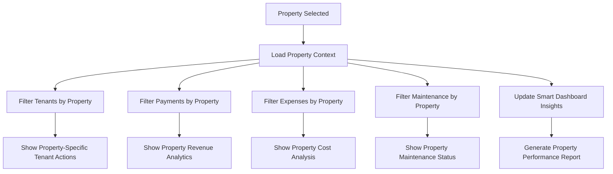
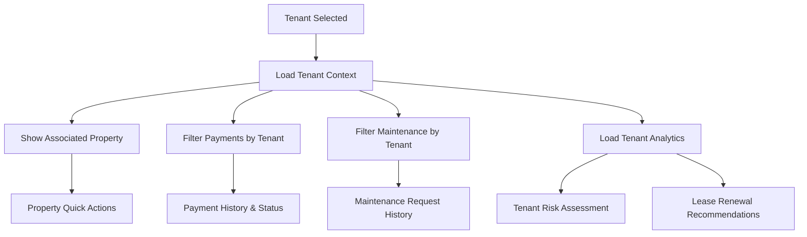

# Dashboard Sections Integration Plan
## Complete Interconnected Property Management System

---

## Table of Contents
1. [System Overview](#system-overview)
2. [Current Dashboard Sections Analysis](#current-dashboard-sections-analysis)
3. [Integration Architecture](#integration-architecture)
4. [Cross-Section Data Flow](#cross-section-data-flow)
5. [Unified Design System](#unified-design-system)
6. [Smart Dashboard Integration](#smart-dashboard-integration)
7. [Section-by-Section Integration Plan](#section-by-section-integration-plan)
8. [Implementation Roadmap](#implementation-roadmap)
9. [Technical Specifications](#technical-specifications)
10. [User Experience Flow](#user-experience-flow)

---

## System Overview

The HNV1 property management system consists of multiple interconnected sections that need to work seamlessly together. This plan outlines how to create a unified, intelligent dashboard where all sections share data, maintain consistent design, and provide contextual navigation.

### Core Philosophy
- **Data Interconnectivity**: Every section should be aware of and utilize data from other sections
- **Contextual Navigation**: Users should be able to move between sections while maintaining context
- **Unified Experience**: Consistent design language and interaction patterns across all sections
- **Smart Insights**: AI-powered recommendations and insights based on cross-section data analysis

---

## Current Dashboard Sections Analysis

### 1. Smart Dashboard (Main Hub)
**Current State**: AI-powered overview with tabs for insights, predictions, automation
**Role**: Central command center with cross-section analytics

**Key Features**:
- Overview tab with welcome section and key metrics
- AI Insights tab with SmartDashboard component
- Predictive Analytics for forecasting
- Automation Center for workflow management
- Performance Optimizer for system optimization

### 2. Properties Section
**Current State**: Property management with enhanced cards and detail pages
**Role**: Core asset management

**Key Features**:
- Property listing with occupancy tracking
- Enhanced property cards with tenant avatars
- Property detail pages with analytics dashboard
- Unit management and nickname system
- Bulk operations and lease management

### 3. Tenants Section
**Current State**: Comprehensive tenant management with advanced features
**Role**: Relationship and lease management

**Key Features**:
- Tenant listing with payment status indicators
- Enhanced tenant cards with scoring system
- Tenant detail pages with complete information tabs
- Predictive search and advanced filtering
- Bulk actions and automation rules

### 4. Payments Section
**Current State**: Payment tracking with multiple collection methods
**Role**: Financial transaction management

**Key Features**:
- Payment cards with status indicators
- Multiple payment collection methods
- Bulk payment processing
- Agent handover functionality
- Export and reporting capabilities

### 5. Expenses Section
**Current State**: Expense tracking with categorization
**Role**: Cost management and financial tracking

**Key Features**:
- Expense cards with category badges
- Property-specific expense tracking
- Date-based filtering and sorting
- Export functionality
- Vendor communication integration

### 6. Maintenance Section
**Current State**: Request management with status tracking
**Role**: Property upkeep and issue resolution

**Key Features**:
- Maintenance request cards with priority indicators
- Status workflow management
- Property and tenant association
- Bulk status updates
- Communication integration

### 7. Settings Section
**Current State**: Multi-tab configuration system
**Role**: System configuration and user management

**Key Features**:
- Profile management
- Organization settings
- Security configuration (2FA, password changes)
- Notification preferences
- Theme and language settings

---

## Integration Architecture

### Data Layer Integration
```typescript
// Unified Data Context
interface UnifiedDashboardContext {
  // Cross-section data
  properties: Property[];
  tenants: Tenant[];
  payments: Payment[];
  expenses: Expense[];
  maintenance: MaintenanceRequest[];
  
  // Computed insights
  insights: {
    occupancyTrends: OccupancyTrend[];
    paymentPatterns: PaymentPattern[];
    maintenanceAlerts: MaintenanceAlert[];
    financialSummary: FinancialSummary;
    riskAssessments: RiskAssessment[];
  };
  
  // Smart recommendations
  recommendations: {
    rentOptimization: RentRecommendation[];
    maintenanceScheduling: MaintenanceSchedule[];
    tenantRetention: RetentionStrategy[];
    costOptimization: CostOptimization[];
  };
  
  // Real-time updates
  realTimeUpdates: {
    newPayments: Payment[];
    urgentMaintenance: MaintenanceRequest[];
    leaseExpirations: LeaseExpiration[];
    systemAlerts: SystemAlert[];
  };
}
```

### Component Architecture
```typescript
// Universal Component System
interface UniversalComponentProps {
  section: 'properties' | 'tenants' | 'payments' | 'expenses' | 'maintenance' | 'settings';
  context?: any;
  crossSectionData?: UnifiedDashboardContext;
  onNavigate?: (section: string, context?: any) => void;
  onDataUpdate?: (section: string, data: any) => void;
}

// Smart Navigation System
interface SmartNavigationContext {
  currentSection: string;
  previousSection: string;
  navigationHistory: NavigationHistoryItem[];
  contextualData: any;
  quickActions: QuickAction[];
}
```

---

## Cross-Section Data Flow

### 1. Property → Other Sections Flow


### 2. Tenant → Other Sections Flow


### 3. Smart Insights Generation
```typescript
// Cross-section analytics engine
class SmartInsightsEngine {
  generatePropertyInsights(propertyId: string): PropertyInsights {
    const property = this.getProperty(propertyId);
    const tenants = this.getTenantsByProperty(propertyId);
    const payments = this.getPaymentsByProperty(propertyId);
    const expenses = this.getExpensesByProperty(propertyId);
    const maintenance = this.getMaintenanceByProperty(propertyId);
    
    return {
      occupancyTrend: this.calculateOccupancyTrend(tenants),
      revenueAnalysis: this.analyzeRevenue(payments, expenses),
      maintenanceScore: this.calculateMaintenanceScore(maintenance),
      profitability: this.calculateProfitability(payments, expenses),
      riskFactors: this.assessRisks(tenants, payments, maintenance),
      recommendations: this.generateRecommendations(property, tenants, payments, expenses, maintenance)
    };
  }
  
  generateTenantInsights(tenantId: string): TenantInsights {
    const tenant = this.getTenant(tenantId);
    const payments = this.getPaymentsByTenant(tenantId);
    const maintenance = this.getMaintenanceByTenant(tenantId);
    
    return {
      paymentReliability: this.calculatePaymentScore(payments),
      maintenanceFrequency: this.analyzeMaintenancePattern(maintenance),
      leaseRenewalProbability: this.predictLeaseRenewal(tenant, payments, maintenance),
      riskLevel: this.assessTenantRisk(tenant, payments, maintenance),
      communicationPreferences: this.analyzeCommunicationPatterns(tenant)
    };
  }
}
```

---

## Unified Design System

### 1. Component Standardization
```typescript
// Universal Card System
interface UniversalCardConfig {
  section: SectionType;
  gradient: GradientType;
  data: any;
  actions: CardAction[];
  contextualInfo: ContextualInfo;
  crossSectionLinks: CrossSectionLink[];
}

// Standardized Action Buttons
interface UniversalActionButton {
  variant: 'primary' | 'secondary' | 'success' | 'warning' | 'danger';
  size: 'sm' | 'md' | 'lg';
  icon?: IconType;
  crossSectionAction?: boolean;
  targetSection?: string;
  contextData?: any;
}

// Smart Status Badges
interface SmartStatusBadge {
  status: string;
  variant: BadgeVariant;
  icon?: IconType;
  tooltip?: string;
  relatedSections?: string[];
  actionable?: boolean;
}
```

### 2. Navigation System
```typescript
// Contextual Navigation
interface ContextualNavigation {
  breadcrumbs: BreadcrumbItem[];
  quickActions: QuickAction[];
  relatedSections: RelatedSection[];
  smartSuggestions: SmartSuggestion[];
}

// Smart Breadcrumbs
interface SmartBreadcrumb {
  section: string;
  label: string;
  context?: any;
  icon?: IconType;
  actions?: BreadcrumbAction[];
}
```

### 3. Color and Theme System
```css
/* Unified Color Palette */
:root {
  /* Section-specific gradients */
  --gradient-properties: linear-gradient(135deg, #3B82F6, #8B5CF6);
  --gradient-tenants: linear-gradient(135deg, #10B981, #3B82F6);
  --gradient-payments: linear-gradient(135deg, #F59E0B, #EF4444);
  --gradient-expenses: linear-gradient(135deg, #EF4444, #DC2626);
  --gradient-maintenance: linear-gradient(135deg, #F97316, #EA580C);
  --gradient-settings: linear-gradient(135deg, #8B5CF6, #6366F1);
  
  /* Smart dashboard gradients */
  --gradient-insights: linear-gradient(135deg, #06B6D4, #3B82F6);
  --gradient-predictions: linear-gradient(135deg, #8B5CF6, #EC4899);
  --gradient-automation: linear-gradient(135deg, #10B981, #059669);
  
  /* Status colors */
  --color-success: #10B981;
  --color-warning: #F59E0B;
  --color-error: #EF4444;
  --color-info: #3B82F6;
  --color-neutral: #6B7280;
}
```

---

## Smart Dashboard Integration

### 1. Enhanced Overview Tab
```typescript
// Smart Dashboard Overview
interface SmartDashboardOverview {
  // Real-time metrics
  liveMetrics: {
    totalRevenue: number;
    occupancyRate: number;
    maintenanceAlerts: number;
    paymentsPending: number;
  };
  
  // Cross-section insights
  insights: {
    topPerformingProperties: Property[];
    riskTenants: Tenant[];
    upcomingLeaseExpirations: LeaseExpiration[];
    maintenanceTrends: MaintenanceTrend[];
  };
  
  // Smart recommendations
  recommendations: {
    rentOptimization: RentRecommendation[];
    maintenanceScheduling: MaintenanceSchedule[];
    tenantRetention: RetentionStrategy[];
  };
  
  // Quick actions with context
  contextualActions: {
    urgentActions: UrgentAction[];
    suggestedActions: SuggestedAction[];
    scheduledActions: ScheduledAction[];
  };
}
```

### 2. AI Insights Integration
```typescript
// AI-Powered Insights Engine
class AIInsightsEngine {
  generateCrossSecti onInsights(): CrossSectionInsights {
    return {
      // Property insights
      propertyPerformance: this.analyzePropertyPerformance(),
      occupancyPredictions: this.predictOccupancyTrends(),
      
      // Tenant insights
      tenantBehaviorAnalysis: this.analyzeTenantBehavior(),
      churnRiskAssessment: this.assessChurnRisk(),
      
      // Financial insights
      revenueForecasting: this.forecastRevenue(),
      expenseOptimization: this.optimizeExpenses(),
      
      // Maintenance insights
      predictiveMaintenance: this.predictMaintenanceNeeds(),
      costEfficiencyAnalysis: this.analyzeMaintenanceCosts(),
      
      // Market insights
      marketComparison: this.compareToMarket(),
      pricingRecommendations: this.recommendPricing()
    };
  }
}
```

---

## Section-by-Section Integration Plan

### 1. Properties Section Enhancement

#### Current State Integration
- **From**: Basic property cards with tenant avatars
- **To**: Smart property cards with cross-section insights

#### New Features
```typescript
// Enhanced Property Card
interface EnhancedPropertyCard {
  // Existing features
  basicInfo: PropertyBasicInfo;
  tenantAvatars: TenantAvatar[];
  occupancyRate: number;
  
  // New cross-section features
  smartInsights: {
    revenuePerformance: RevenuePerformance;
    maintenanceScore: MaintenanceScore;
    tenantSatisfaction: TenantSatisfaction;
    marketComparison: MarketComparison;
  };
  
  // Contextual actions
  smartActions: {
    rentOptimization: RentOptimizationAction;
    maintenanceScheduling: MaintenanceSchedulingAction;
    tenantCommunication: TenantCommunicationAction;
    financialReporting: FinancialReportingAction;
  };
  
  // Cross-section navigation
  quickNavigation: {
    viewTenants: () => void;
    viewPayments: () => void;
    viewExpenses: () => void;
    viewMaintenance: () => void;
  };
}
```

#### Property Details Page Enhancement
```typescript
// Enhanced Property Details
interface EnhancedPropertyDetails {
  // Existing tabs
  analytics: PropertyAnalyticsDashboard;
  relatedData: RelatedDataSections;
  units: EnhancedUnitsGrid;
  
  // New integrated tabs
  smartInsights: {
    aiRecommendations: AIRecommendation[];
    performanceBenchmarks: PerformanceBenchmark[];
    riskAssessment: RiskAssessment;
    optimizationSuggestions: OptimizationSuggestion[];
  };
  
  // Cross-section widgets
  liveWidgets: {
    tenantStatusWidget: TenantStatusWidget;
    paymentStatusWidget: PaymentStatusWidget;
    maintenanceStatusWidget: MaintenanceStatusWidget;
    expenseTrackingWidget: ExpenseTrackingWidget;
  };
}
```

### 2. Tenants Section Enhancement

#### Smart Tenant Cards
```typescript
// Enhanced Tenant Card
interface EnhancedTenantCard {
  // Existing features
  basicInfo: TenantBasicInfo;
  paymentStatus: PaymentStatus;
  tenantScore: TenantScore;
  
  // New cross-section features
  smartInsights: {
    paymentPrediction: PaymentPrediction;
    maintenanceHistory: MaintenanceHistory;
    leaseRenewalProbability: LeaseRenewalProbability;
    communicationPreferences: CommunicationPreferences;
  };
  
  // Property context
  propertyContext: {
    propertyPerformance: PropertyPerformance;
    neighborTenants: NeighborTenant[];
    unitComparison: UnitComparison;
  };
  
  // Smart actions
  contextualActions: {
    paymentReminder: PaymentReminderAction;
    leaseRenewal: LeaseRenewalAction;
    maintenanceRequest: MaintenanceRequestAction;
    communicationLog: CommunicationLogAction;
  };
}
```

#### Tenant Details Page Enhancement
```typescript
// Enhanced Tenant Details
interface EnhancedTenantDetails {
  // Existing tabs
  overview: TenantOverview;
  paymentHistory: PaymentHistory;
  maintenance: MaintenanceHistory;
  analytics: TenantAnalytics;
  documents: DocumentManagement;
  personalDetails: PersonalDetails;
  
  // New integrated tabs
  smartProfile: {
    behaviorAnalysis: BehaviorAnalysis;
    riskAssessment: RiskAssessment;
    communicationLog: CommunicationLog;
    leaseHistory: LeaseHistory;
  };
  
  // Cross-section integration
  propertyIntegration: {
    propertyDetails: PropertyDetails;
    unitNeighbors: UnitNeighbors;
    propertyRules: PropertyRules;
  };
  
  // Predictive features
  predictions: {
    paymentBehavior: PaymentBehaviorPrediction;
    leaseRenewal: LeaseRenewalPrediction;
    maintenanceNeeds: MaintenanceNeedsPrediction;
  };
}
```

### 3. Payments Section Enhancement

#### Smart Payment Cards
```typescript
// Enhanced Payment Card
interface EnhancedPaymentCard {
  // Existing features
  basicInfo: PaymentBasicInfo;
  status: PaymentStatus;
  
  // New cross-section features
  tenantContext: {
    tenantProfile: TenantProfile;
    paymentHistory: PaymentHistory;
    riskLevel: RiskLevel;
  };
  
  // Property context
  propertyContext: {
    propertyRevenue: PropertyRevenue;
    unitPerformance: UnitPerformance;
  };
  
  // Smart insights
  insights: {
    paymentPattern: PaymentPattern;
    anomalyDetection: AnomalyDetection;
    collectionEfficiency: CollectionEfficiency;
  };
  
  // Automated actions
  smartActions: {
    followUpReminder: FollowUpReminderAction;
    receiptGeneration: ReceiptGenerationAction;
    tenantCommunication: TenantCommunicationAction;
  };
}
```

### 4. Expenses Section Enhancement

#### Smart Expense Cards
```typescript
// Enhanced Expense Card
interface EnhancedExpenseCard {
  // Existing features
  basicInfo: ExpenseBasicInfo;
  category: ExpenseCategory;
  
  // New cross-section features
  propertyImpact: {
    propertyProfitability: PropertyProfitability;
    maintenanceCorrelation: MaintenanceCorrelation;
    tenantImpact: TenantImpact;
  };
  
  // Smart categorization
  smartCategorization: {
    autoCategory: AutoCategory;
    taxImplications: TaxImplications;
    budgetImpact: BudgetImpact;
  };
  
  // Cost optimization
  optimization: {
    costComparison: CostComparison;
    vendorAnalysis: VendorAnalysis;
    efficiencyRecommendations: EfficiencyRecommendation[];
  };
}
```

### 5. Maintenance Section Enhancement

#### Smart Maintenance Cards
```typescript
// Enhanced Maintenance Card
interface EnhancedMaintenanceCard {
  // Existing features
  basicInfo: MaintenanceBasicInfo;
  status: MaintenanceStatus;
  priority: MaintenancePriority;
  
  // New cross-section features
  tenantImpact: {
    tenantSatisfaction: TenantSatisfaction;
    leaseRenewalRisk: LeaseRenewalRisk;
    communicationHistory: CommunicationHistory;
  };
  
  // Property context
  propertyContext: {
    maintenanceHistory: MaintenanceHistory;
    propertyCondition: PropertyCondition;
    preventiveMaintenance: PreventiveMaintenance;
  };
  
  // Cost analysis
  costAnalysis: {
    expenseCorrelation: ExpenseCorrelation;
    budgetImpact: BudgetImpact;
    costOptimization: CostOptimization;
  };
  
  // Predictive maintenance
  predictions: {
    recurringIssues: RecurringIssue[];
    preventiveScheduling: PreventiveScheduling;
    costForecasting: CostForecasting;
  };
}
```

### 6. Settings Section Enhancement

#### Smart Configuration
```typescript
// Enhanced Settings
interface EnhancedSettings {
  // Existing tabs
  profile: ProfileSettings;
  organization: OrganizationSettings;
  notifications: NotificationSettings;
  security: SecuritySettings;
  preferences: PreferenceSettings;
  
  // New smart tabs
  automation: {
    workflowRules: WorkflowRule[];
    smartNotifications: SmartNotification[];
    autoActions: AutoAction[];
  };
  
  // Integration settings
  integrations: {
    paymentGateways: PaymentGateway[];
    communicationChannels: CommunicationChannel[];
    reportingTools: ReportingTool[];
    thirdPartyServices: ThirdPartyService[];
  };
  
  // Analytics preferences
  analytics: {
    dashboardCustomization: DashboardCustomization;
    reportPreferences: ReportPreferences;
    insightSettings: InsightSettings;
  };
}
```

---

## Implementation Roadmap

### Phase 1: Foundation (Weeks 1-2)
**Goal**: Establish unified data layer and component system

#### Week 1: Data Layer
- [ ] Implement UnifiedDashboardContext
- [ ] Create cross-section data hooks
- [ ] Set up real-time data synchronization
- [ ] Implement smart caching system

#### Week 2: Component System
- [ ] Standardize UniversalCard components
- [ ] Implement smart navigation system
- [ ] Create contextual action buttons
- [ ] Set up unified design tokens

### Phase 2: Smart Dashboard Enhancement (Weeks 3-4)
**Goal**: Transform main dashboard into intelligent command center

#### Week 3: Overview Enhancement
- [ ] Implement smart metrics calculation
- [ ] Add cross-section insights widgets
- [ ] Create contextual quick actions
- [ ] Implement real-time updates

#### Week 4: AI Integration
- [ ] Implement SmartInsightsEngine
- [ ] Add predictive analytics
- [ ] Create recommendation system
- [ ] Implement automation center

### Phase 3: Section Integration (Weeks 5-8)
**Goal**: Enhance each section with cross-section awareness

#### Week 5: Properties & Tenants
- [ ] Enhance property cards with smart insights
- [ ] Add cross-section navigation
- [ ] Implement contextual actions
- [ ] Add tenant behavior analysis

#### Week 6: Payments & Expenses
- [ ] Add payment pattern analysis
- [ ] Implement expense optimization
- [ ] Create cost correlation insights
- [ ] Add automated workflows

#### Week 7: Maintenance & Settings
- [ ] Implement predictive maintenance
- [ ] Add maintenance cost analysis
- [ ] Enhance settings with automation
- [ ] Create integration management

#### Week 8: Testing & Optimization
- [ ] Comprehensive testing
- [ ] Performance optimization
- [ ] User experience refinement
- [ ] Documentation completion

### Phase 4: Advanced Features (Weeks 9-10)
**Goal**: Add advanced AI and automation features

#### Week 9: Advanced AI
- [ ] Machine learning model integration
- [ ] Advanced prediction algorithms
- [ ] Behavioral analysis engine
- [ ] Market comparison tools

#### Week 10: Automation & Workflows
- [ ] Advanced workflow engine
- [ ] Smart notification system
- [ ] Automated decision making
- [ ] Integration with external services

---

## Technical Specifications

### 1. Data Architecture
```typescript
// Unified State Management
interface UnifiedState {
  // Section data
  properties: PropertyState;
  tenants: TenantState;
  payments: PaymentState;
  expenses: ExpenseState;
  maintenance: MaintenanceState;
  settings: SettingsState;
  
  // Cross-section computed data
  insights: InsightsState;
  recommendations: RecommendationsState;
  predictions: PredictionsState;
  
  // UI state
  navigation: NavigationState;
  filters: FiltersState;
  preferences: PreferencesState;
}

// Smart Data Hooks
const useSmartData = (section: string, context?: any) => {
  const unifiedData = useUnifiedDashboardContext();
  const sectionData = unifiedData[section];
  const crossSectionData = useCrossSectionData(section, context);
  const insights = useSmartInsights(section, sectionData, crossSectionData);
  
  return {
    data: sectionData,
    crossSectionData,
    insights,
    actions: useSmartActions(section, context)
  };
};
```

### 2. Component Architecture
```typescript
// Universal Component System
interface UniversalComponentSystem {
  // Base components
  UniversalCard: React.FC<UniversalCardProps>;
  UniversalHeader: React.FC<UniversalHeaderProps>;
  UniversalSearch: React.FC<UniversalSearchProps>;
  UniversalExport: React.FC<UniversalExportProps>;
  
  // Smart components
  SmartInsightsWidget: React.FC<SmartInsightsProps>;
  ContextualNavigation: React.FC<ContextualNavigationProps>;
  CrossSectionLinks: React.FC<CrossSectionLinksProps>;
  SmartRecommendations: React.FC<SmartRecommendationsProps>;
  
  // Section-specific enhanced components
  EnhancedPropertyCard: React.FC<EnhancedPropertyCardProps>;
  EnhancedTenantCard: React.FC<EnhancedTenantCardProps>;
  EnhancedPaymentCard: React.FC<EnhancedPaymentCardProps>;
  EnhancedExpenseCard: React.FC<EnhancedExpenseCardProps>;
  EnhancedMaintenanceCard: React.FC<EnhancedMaintenanceCardProps>;
}
```

### 3. API Integration
```typescript
// Unified API Layer
interface UnifiedAPILayer {
  // Cross-section endpoints
  getCrossSectionData: (sections: string[], context?: any) => Promise<CrossSectionData>;
  getSmartInsights: (section: string, context?: any) => Promise<SmartInsights>;
  getRecommendations: (type: string, context?: any) => Promise<Recommendation[]>;
  
  // Real-time updates
  subscribeToUpdates: (sections: string[], callback: UpdateCallback) => Subscription;
  
  // Smart actions
  executeSmartAction: (action: SmartAction, context?: any) => Promise<ActionResult>;
}
```

---

## User Experience Flow

### 1. Unified Navigation Experience
```typescript
// Smart Navigation Flow
interface NavigationFlow {
  // Context preservation
  maintainContext: (fromSection: string, toSection: string, context: any) => void;
  
  // Smart breadcrumbs
  generateBreadcrumbs: (currentPath: NavigationPath) => Breadcrumb[];
  
  // Contextual actions
  getContextualActions: (section: string, context: any) => ContextualAction[];
  
  // Quick navigation
  getQuickNavigation: (currentSection: string) => QuickNavigation[];
}

// Example: Property → Tenant Navigation
const navigateFromPropertyToTenant = (propertyId: string, tenantId?: string) => {
  const context = {
    propertyId,
    tenantId,
    returnPath: `/dashboard/properties/${propertyId}`,
    filters: { propertyId }
  };
  
  navigate('/dashboard/tenants', { state: context });
};
```

### 2. Contextual Data Display
```typescript
// Context-Aware Components
const ContextualTenantCard = ({ tenant, context }: ContextualTenantCardProps) => {
  const { propertyContext, paymentContext, maintenanceContext } = context;
  
  return (
    <EnhancedTenantCard
      tenant={tenant}
      propertyInfo={propertyContext}
      paymentInsights={paymentContext}
      maintenanceAlerts={maintenanceContext}
      contextualActions={getContextualActions('tenant', context)}
    />
  );
};
```

### 3. Smart Recommendations
```typescript
// Recommendation Engine
interface RecommendationEngine {
  // Property recommendations
  getPropertyRecommendations: (propertyId: string) => PropertyRecommendation[];
  
  // Tenant recommendations
  getTenantRecommendations: (tenantId: string) => TenantRecommendation[];
  
  // Financial recommendations
  getFinancialRecommendations: (context: FinancialContext) => FinancialRecommendation[];
  
  // Maintenance recommendations
  getMaintenanceRecommendations: (context: MaintenanceContext) => MaintenanceRecommendation[];
}

// Example recommendations
const propertyRecommendations = [
  {
    type: 'rent_optimization',
    title: 'Optimize Rent for Unit 2A',
    description: 'Market analysis suggests 8% rent increase potential',
    impact: 'high',
    action: 'schedule_rent_review',
    data: { unitId: '2A', suggestedIncrease: 8, marketComparison: {...} }
  },
  {
    type: 'maintenance_scheduling',
    title: 'Schedule Preventive HVAC Maintenance',
    description: 'Based on usage patterns and maintenance history',
    impact: 'medium',
    action: 'schedule_maintenance',
    data: { type: 'hvac', suggestedDate: '2024-03-15', cost: 250 }
  }
];
```

---

## Success Metrics

### 1. User Experience Metrics
- **Navigation Efficiency**: Reduce clicks between related sections by 40%
- **Task Completion Time**: Decrease average task completion time by 30%
- **User Satisfaction**: Achieve 90%+ satisfaction rating for integrated experience
- **Feature Discovery**: Increase cross-section feature usage by 60%

### 2. System Performance Metrics
- **Data Loading Speed**: Maintain sub-2-second load times for all sections
- **Real-time Updates**: Achieve <1-second update propagation across sections
- **Cache Efficiency**: Achieve 85%+ cache hit rate for cross-section data
- **API Response Time**: Maintain <500ms average API response time

### 3. Business Impact Metrics
- **Operational Efficiency**: Reduce property management time by 25%
- **Revenue Optimization**: Identify 15%+ revenue improvement opportunities
- **Cost Reduction**: Achieve 10%+ cost savings through smart recommendations
- **Tenant Satisfaction**: Improve tenant satisfaction scores by 20%

---

## Conclusion

This comprehensive integration plan transforms the HNV1 dashboard from a collection of separate sections into a unified, intelligent property management system. By implementing cross-section data sharing, smart insights, and contextual navigation, users will experience a seamless workflow that anticipates their needs and provides actionable recommendations.

The phased implementation approach ensures steady progress while maintaining system stability, and the focus on user experience ensures that the enhanced functionality translates into real productivity gains for property managers.

The end result will be a property management system that not only manages data but actively helps users make better decisions, optimize their operations, and improve their business outcomes through intelligent automation and insights.